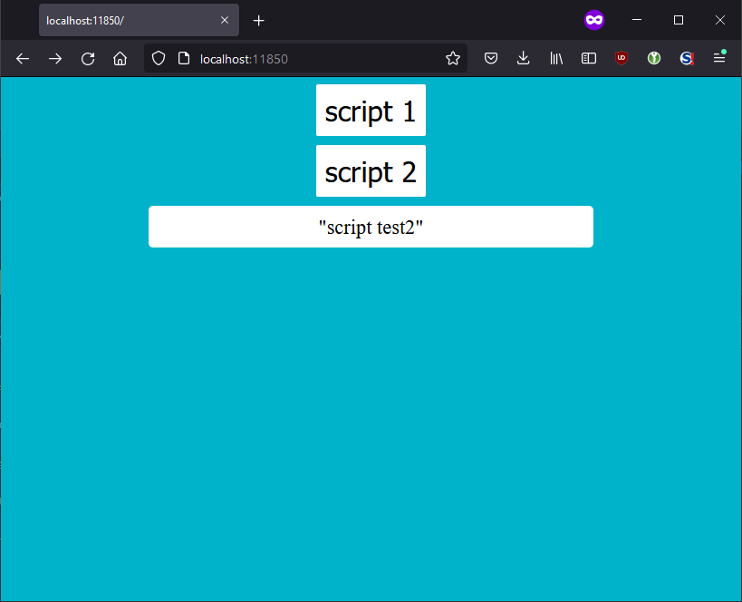

# WebScript

Small webpage where you can execute a script by pressing a button

---

## Screenshot

---

## Requirement

- python > 3.6
- bottle.py (`pip install bottle` or download the [bottle py file](https://raw.githubusercontent.com/bottlepy/bottle/master/bottle.py) directly into your directory)
 )
- can be used on Window, linux, mac as long as it get python

---

## How to use

Download and place the `wp.py` (and `bottle.py` if you downloaded it) in a directory.

Create your script with .sh, .bat or whatever.

Edit `wp.py` and change the value of sample_config with the name you want to display and the path + argument of the script

### For the example :

Download and place the `wp.py` and `bottle.py` in a directory.

Execute `python wp.py` in a cmd, then open a browser and go to `http://localhost:11850`

---

## How it work

It look at at a dictionnary of script_name:path_of_the_script, then create a button for each of the entry in the dictionnary.

When you click on a button, it call subprocess.check_output to execute path_of_the_script

It will wait until the script finish running before displaying text.
